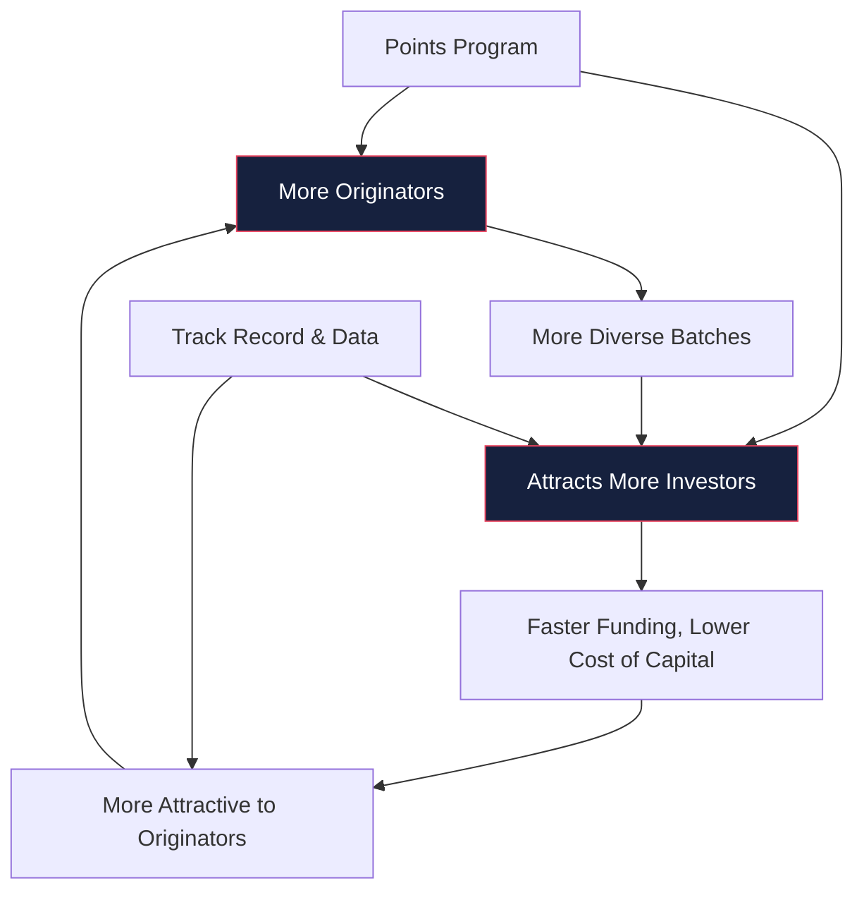

# Business Model

> **Aurora Protocol generates revenue through a transparent, single-source fee model while building a self-reinforcing growth flywheel connecting originators, investors, and the platform ecosystem.**

---

## Revenue Model

Aurora Protocol operates on a lean, transparent revenue model with a single fee source:

| Revenue Source | Description | Rate | Status |
|----------------|-------------|------|--------|
| **Platform Fee** | One-time fee on each batch, deducted from funded capital before disbursement to Originator | ≤ 3% per batch | Active |
| **Secondary Market Fee** | Transaction fee on peer-to-peer RWA token trading | TBD | Planned |
| **Data Services** | Premium agricultural and performance analytics for institutional participants | TBD | Planned |

> *Currently, the Platform Fee is the only active revenue source. Future revenue streams will be introduced as the protocol matures.*

---

## Revenue Scaling Model

Platform revenue scales linearly with total batch volume:

| Annual Batch Volume | Platform Fee (at 2.5%) | Batches (at $100K avg.) |
|--------------------:|----------------------:|------------------------:|
| $1,000,000 | $25,000 | 10 |
| $5,000,000 | $125,000 | 50 |
| $10,000,000 | $250,000 | 100 |
| $50,000,000 | $1,250,000 | 500 |

---

## Growth Flywheel

The Aurora Protocol business model is designed around a self-reinforcing loop:

**Flywheel drivers:**

The flywheel begins with onboarding verified originators who bring real agricultural assets to the platform. A growing supply of diverse, verified batches attracts more investors seeking real-yield opportunities. As investor participation increases, batches fund faster and originators benefit from more competitive capital costs. This makes Aurora increasingly attractive to new originators, completing the cycle. The Points Program and the protocol's growing performance track record serve as additional accelerants on both the supply and demand sides.

---

## Cost Structure

| Cost Category | Description |
|---------------|-------------|
| **Smart Contract Deployment** | One-time gas cost per batch (optimized via minimal proxy clones) |
| **Verification Operations** | Manual verification and inspection costs per batch |
| **Infrastructure** | Frontend hosting, indexing services, monitoring |
| **Team** | Core team compensation |
| **Legal & Compliance** | Ongoing regulatory advisory and compliance monitoring |

---

## Path to Sustainability

Aurora Protocol's path to self-sustaining operations follows three phases:

| Phase | Batch Volume Target | Focus |
|-------|--------------------:|-------|
| **Phase 1** — Bootstrap | $1M–$5M | Prove unit economics, build track record |
| **Phase 2** — Scale | $5M–$25M | Expand originator network, introduce secondary market |
| **Phase 3** — Mature | $25M+ | Diversify revenue streams, achieve operational profitability |

---

> **Next**: [Originator Security →](Originator-Security.md)
