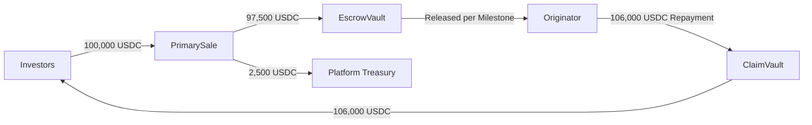

# Unit Economics

> **A transparent breakdown of how value flows through a single Aurora Protocol financing batch — from investor subscription to final redemption.**

---

## Overview

Each batch on Aurora Protocol operates as an independent economic unit. Understanding the unit economics of a single batch is essential for investors evaluating returns and for originators assessing the cost of capital.

This section models the economics of a representative batch to illustrate the fee structure, yield mechanics, and net returns to each participant.

---

## Representative Batch Model

| Parameter | Value |
|-----------|-------|
| **Batch Size** | $100,000 USDC |
| **Token Supply** | 10,000 RWA Tokens |
| **Token Price** | $10 USDC per token |
| **Batch Duration** | 6 months |
| **Gross Yield (Originator-Paid)** | 12% annualized (6% for 6-month term) |
| **Platform Fee** | 2.5% of batch size (one-time) |

---

## Cash Flow Breakdown

### Investor Perspective

| Item | Amount (USDC) | Calculation |
|------|---------------|-------------|
| Investment | 100,000 | Subscription total |
| Gross Return | 106,000 | 100,000 × (1 + 6%) |
| Platform Fee | 0 | Borne by Originator, not investors |
| **Net Payout to Investors** | **106,000** | Principal + yield |
| **Net Yield** | **6.0%** | Over 6-month term |

### Originator Perspective

| Item | Amount (USDC) | Calculation |
|------|---------------|-------------|
| Capital Received | 97,500 | 100,000 − 2,500 (platform fee) |
| Repayment Obligation | 106,000 | 100,000 principal + 6,000 yield |
| Platform Fee | 2,500 | 2.5% of batch size |
| **Total Cost of Capital** | **8,500** | Yield + fee |
| **Effective Cost Rate** | **8.72%** | 8,500 / 97,500 (annualized: ~17.4%) |

### Platform Perspective

| Item | Amount (USDC) | Calculation |
|------|---------------|-------------|
| **Platform Fee Revenue** | **2,500** | 2.5% × 100,000 |

---

## Value Flow Diagram

---

## Fee Structure

| Fee Type | Rate | Paid By | When |
|----------|------|---------|------|
| **Platform Fee** | ≤ 3% of batch size | Originator | Deducted at funding |
| **Gas Fees** | Variable (Ethereum) | Transaction initiator | Per transaction |
| **Subscription Fee** | None | — | — |
| **Redemption Fee** | None | — | — |

> *The platform fee is the sole protocol-level revenue source. There are no hidden fees, performance fees, or management fees charged to investors.*

---

## Yield Disclaimer

> **Important**: Yield figures in this section are illustrative examples only. Actual yields vary by batch and are determined by the specific terms agreed between the Originator and the platform. Past batch performance does not guarantee future results. Agricultural financing carries inherent risks — see [Risks](../Risks.md) for a full discussion.

---

> **Next**: [Business Model →](Business-Model.md)
