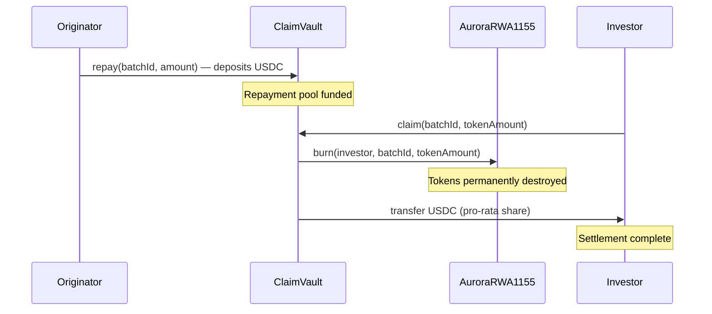

# Burn-to-Claim

> **Aurora Protocol's redemption mechanism requires investors to permanently burn their RWA tokens in exchange for their proportional share of repaid capital — ensuring a clean, one-time settlement with no residual token claims.**

---

## Overview

The **Burn-to-Claim** mechanism is implemented in the `ClaimVault` contract. It governs the final stage of the batch lifecycle: when the Originator repays principal plus yield, investors exchange (burn) their ERC-1155 RWA tokens to receive `USDC` payouts.

This design ensures that each token can only be redeemed once, eliminates the possibility of double claims, and provides a cryptographically verifiable settlement process.

---

## How It Works



---

## Step-by-Step Process

### Step 1 — Originator Repayment

After all milestones are completed, the Originator deposits the full repayment amount (principal + yield) into `ClaimVault` by calling `repay()`. The repayment is denominated in `USDC`.

### Step 2 — Investor Initiates Claim

An investor holding RWA tokens for the completed batch calls `claim()` on the `ClaimVault`, specifying the number of tokens to redeem.

### Step 3 — Token Burn

The `ClaimVault` calls `burn()` on `AuroraRWA1155`, permanently destroying the specified tokens from the investor's wallet. This is an irreversible on-chain operation.

### Step 4 — USDC Payout

The `ClaimVault` calculates the investor's pro-rata share based on:

```
payout = (tokensBurned / totalTokenSupply) × totalRepaymentPool
```

The calculated `USDC` amount is transferred to the investor's wallet.

---

## Design Rationale

| Property | Benefit |
|----------|---------|
| **Permanent Burn** | Eliminates double-claim risk — once burned, tokens cannot be reused |
| **Pro-Rata Fairness** | Every token carries identical claim weight within a batch |
| **On-Chain Verifiability** | Burn events and transfer events are publicly auditable |
| **No Expiry** | Investors can claim at any time after repayment — no redemption deadline |
| **Atomic Execution** | Burn and payout occur in a single transaction — no partial states |

---

## Key Functions

| Function | Access | Description |
|----------|--------|-------------|
| `repay()` | Originator | Deposits USDC repayment into the claim pool |
| `claim()` | Investor (Token Holder) | Burns tokens and receives proportional USDC payout |
| `claimable()` | Public | Returns the USDC amount claimable for a given token quantity |
| `totalRepaid()` | Public | Returns the total USDC deposited by the Originator |

---

## Edge Cases

| Scenario | Behavior |
|----------|----------|
| **Partial claim** | Investor burns a subset of their tokens; remaining tokens retain claim rights |
| **Batch failed (no repayment)** | ClaimVault remains empty; investors use `EscrowVault.refund()` instead |
| **Originator partial repayment** | Payout is calculated against actual deposited amount, not expected amount |
| **Zero token balance** | Transaction reverts — cannot burn tokens the caller does not hold |

---

> **Next**: [Verification →](Verification.md)
