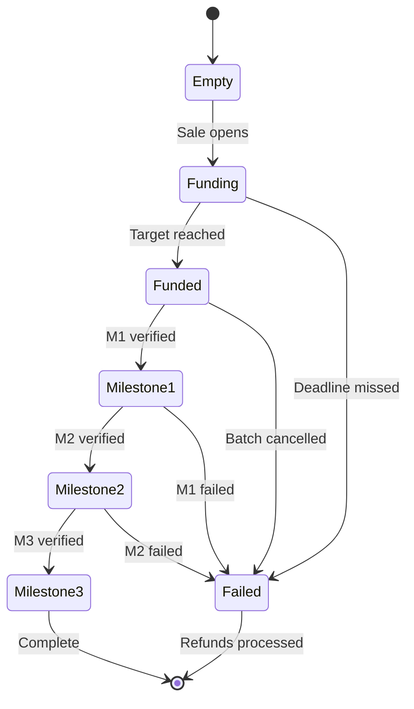

# EscrowVault

> **The EscrowVault contract governs milestone-based fund disbursement through a strict 7-state machine, ensuring investor capital is released only upon verified project progress.**

---

## Overview

`EscrowVault` is the custodial core of Aurora Protocol. It holds pooled `USDC` from investor subscriptions and releases funds to the Originator incrementally as predefined milestones are verified and approved. The contract enforces a deterministic state machine that prevents unauthorized withdrawals and ensures transparent fund management.

---

## State Machine

The EscrowVault operates through **7 distinct states** with strictly defined transitions:

---

## State Definitions

| State | Description | Allowed Transitions |
|-------|-------------|---------------------|
| **Empty** | Initial state. Vault deployed but no funds received. | → Funding |
| **Funding** | Primary sale is active. USDC flowing in from investors. | → Funded, → Failed |
| **Funded** | Funding target reached. Capital locked, awaiting first milestone. | → Milestone1, → Failed |
| **Milestone1** | First milestone verified. First tranche released to Originator. | → Milestone2, → Failed |
| **Milestone2** | Second milestone verified. Second tranche released. | → Milestone3, → Failed |
| **Milestone3** | Final milestone verified. Final tranche released. Batch complete. | → Terminal |
| **Failed** | Batch has failed at any eligible stage. Refund process initiated. | → Terminal |

---

## Transition Rules

The following rules govern all state transitions:

| Rule | Description |
|------|-------------|
| **Forward-Only** | States progress sequentially — no skipping from Funding to Milestone2 |
| **No Reversal** | Once a milestone is confirmed, the vault cannot return to a prior state |
| **Failure Access** | Failed state is reachable from Funding, Funded, Milestone1, and Milestone2 only |
| **Failure Exclusions** | Empty, Milestone3, and Failed itself **cannot** transition to Failed |
| **Single Terminal** | Both Milestone3 (success) and Failed (failure) are terminal states |
| **Operator-Gated** | Milestone transitions require OPERATOR role approval |

---

## Fund Release Schedule

Each milestone release corresponds to a predefined percentage of the total pooled capital:

| Milestone | Typical Phase | Release % | Cumulative |
|-----------|---------------|-----------|------------|
| **Milestone 1** | Planting / Procurement | 30% | 30% |
| **Milestone 2** | Growing / Processing | 35% | 65% |
| **Milestone 3** | Harvest / Delivery | 35% | 100% |

> *Note: Release percentages are configurable per batch at creation time and may vary based on crop type and project structure.*

---

## Failure and Refund Mechanism

When a batch enters the **Failed** state:

1. All remaining `USDC` in the vault is locked for refund processing
2. Investors can call `refund()` to reclaim their pro-rata share of remaining funds
3. Any tranches already released to the Originator prior to failure are **not recoverable** through the smart contract — this risk is mitigated by the Originator's staking collateral (see [Originator Security](../Economics/Originator-Security.md))
4. RWA tokens remain in investor wallets but carry no further claim value

---

## Key Functions

| Function | Access | Description |
|----------|--------|-------------|
| `initialize()` | BatchFactory | Sets batch parameters, milestone percentages, and deadlines |
| `fund()` | PrimarySale | Receives USDC from completed primary sale |
| `releaseMilestone()` | OPERATOR | Advances state and releases tranche to Originator |
| `markFailed()` | OPERATOR | Transitions vault to Failed state |
| `refund()` | Investor | Claims pro-rata refund in Failed state |
| `getState()` | Public | Returns current vault state |

---

> **Next**: [Burn-to-Claim →](Burn-to-Claim.md)
