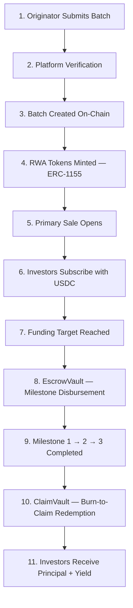

# How It Works

> **A complete lifecycle view of how agricultural financing flows through Aurora Protocol — from batch origination to investor redemption.**

---

## Overview

Aurora Protocol operates as a trustless pipeline connecting agricultural producers (Originators) with global DeFi investors. Each financing cycle is structured as a **Batch** — a discrete, smart-contract-governed unit representing a specific agricultural project with defined terms, milestones, and returns.

The protocol manages every stage on-chain, ensuring full transparency and eliminating reliance on intermediaries.

---

## End-to-End Lifecycle

---

## Step-by-Step Breakdown

### Step 1 — Batch Origination

An Originator (agricultural producer or cooperative) submits a financing request specifying the crop type, required capital, expected yield, repayment timeline, and milestone structure. The Originator must meet platform eligibility requirements, including identity verification and staking collateral (see [Originator Security](../Economics/Originator-Security.md)).

### Step 2 — Platform Verification

The submitted batch undergoes a multi-layer verification process covering identity, agricultural data, financial projections, and on-the-ground validation. For details, see [Verification](Verification.md).

### Step 3 — On-Chain Batch Creation

Once approved, `BatchFactory` deploys a new batch instance using the minimal proxy clone pattern (EIP-1167). Each batch is an independent, isolated smart contract instance with its own parameters and lifecycle.

### Step 4 — RWA Token Minting

`AuroraRWA1155` mints fractional participation tokens (ERC-1155) representing pro-rata claims on the batch's future cash flows. Each token is fungible within its batch but unique across batches.

### Step 5 — Primary Sale

`PrimarySale` opens a subscription window during which investors can purchase RWA tokens using `USDC`. The sale enforces minimum/maximum subscription amounts and a defined funding deadline.

### Step 6 — Investor Subscription

Investors browse available batches, review terms and verification data, and commit `USDC` to purchase tokens. All subscriptions are recorded on-chain.

### Step 7 — Funding Completion

When the batch reaches its funding target, the sale closes and funds are transferred to `EscrowVault`. If the target is not met by the deadline, the batch enters a **Failed** state and investors can reclaim their `USDC`.

### Step 8 — Milestone-Based Disbursement

`EscrowVault` holds the pooled `USDC` and releases funds to the Originator incrementally as predefined milestones are verified and approved. The vault follows a strict 7-state machine (see [EscrowVault](EscrowVault.md)).

### Step 9 — Project Completion

As each milestone is confirmed — typically corresponding to planting, growing, and harvest phases — the Originator receives the corresponding tranche of funds. Upon completion of all three milestones, the Originator repays the batch principal plus agreed yield.

### Step 10 — Burn-to-Claim Redemption

Repaid funds flow into `ClaimVault`. Investors burn their RWA tokens to claim their proportional share of the repayment. See [Burn-to-Claim](Burn-to-Claim.md) for the full mechanism.

### Step 11 — Settlement

Investors receive their principal plus yield in `USDC`. The batch lifecycle is complete.

---

## Key Design Principles

| Principle | Implementation |
|-----------|----------------|
| **Trustless Execution** | All fund flows governed by smart contracts — no manual custody |
| **Transparency** | Every state transition is recorded on Ethereum and publicly verifiable |
| **Isolation** | Each batch is an independent contract instance — failure in one batch does not affect others |
| **Milestone Gating** | Funds are released only upon verified milestone completion — protecting investor capital |
| **Permissionless Investment** | Any wallet holder can participate in primary sales using `USDC` |

---

> **Next**: [Smart Contracts →](Smart-Contracts.md)
