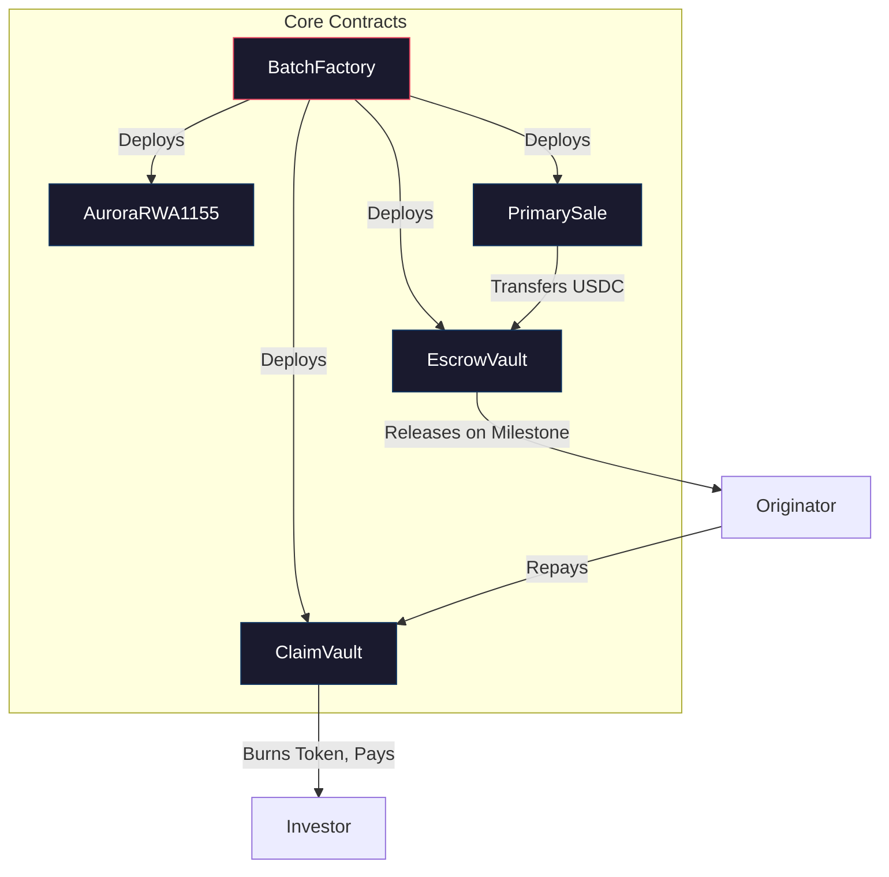
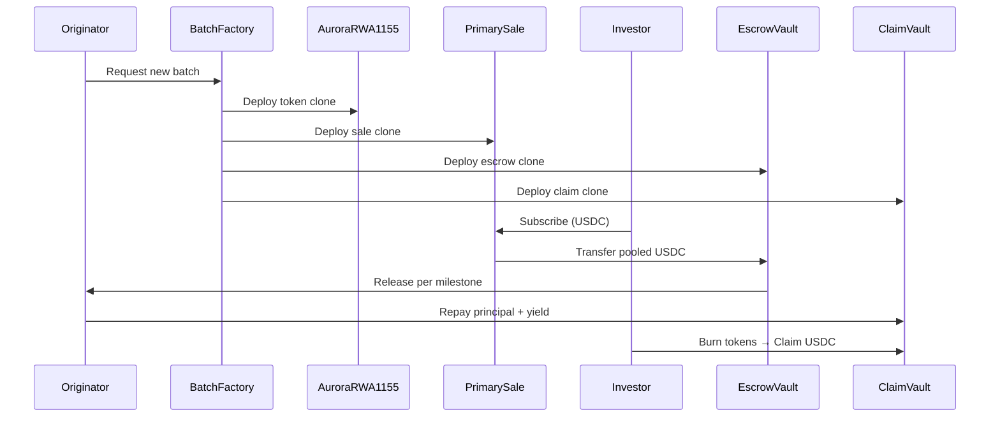

# Smart Contracts

> **Aurora Protocol's on-chain infrastructure is composed of five interdependent smart contracts built on Ethereum with OpenZeppelin libraries and the minimal proxy clone pattern.**

---

## Architecture Overview

---

## Contract Summary

| Contract | Role | Key Functions | Token Standard |
|----------|------|---------------|----------------|
| **BatchFactory** | Factory & orchestrator — deploys and initializes all other contracts per batch | `createBatch()`, `initialize()` | — |
| **AuroraRWA1155** | Mints and manages fractional participation tokens for each batch | `mint()`, `burn()`, `balanceOf()` | ERC-1155 |
| **PrimarySale** | Manages the investor subscription window and USDC collection | `subscribe()`, `close()`, `refund()` | — |
| **EscrowVault** | Holds pooled USDC and releases funds based on milestone verification | `releaseMilestone()`, `markFailed()` | — |
| **ClaimVault** | Accepts repayment and distributes to investors via burn-to-claim | `repay()`, `claim()` | — |

---

## Technical Specifications

| Parameter | Value |
|-----------|-------|
| **Solidity Version** | ^0.8.20 |
| **Framework** | OpenZeppelin Contracts |
| **Deployment Pattern** | Minimal Proxy Clone (EIP-1167) |
| **Network** | Ethereum Mainnet |
| **Settlement Token** | USDC (ERC-20) |
| **Access Control** | Role-Based (OpenZeppelin `AccessControl`) |
| **Upgradeability** | Non-upgradeable (immutable per batch) |

---

## Deployment Pattern

Aurora Protocol uses the **Minimal Proxy Clone** pattern (EIP-1167) to optimize gas costs and ensure contract isolation.

**How it works:**

`BatchFactory` maintains a set of implementation (logic) contracts. When a new batch is created, it deploys lightweight proxy clones that delegate all calls to the shared implementation. Each clone has its own storage, ensuring complete isolation between batches.

| Benefit | Description |
|---------|-------------|
| **Gas Efficiency** | Clone deployment costs ~10x less gas than deploying full contracts |
| **Isolation** | Each batch operates in its own storage context — no cross-contamination |
| **Consistency** | All batches share the same audited logic |
| **Simplicity** | No upgrade mechanism required — each batch is immutable once deployed |

---

## Access Control

Aurora Protocol implements role-based access control with post-deployment admin handover to minimize centralization risk.

| Role | Permissions | Assigned To |
|------|-------------|-------------|
| **DEFAULT_ADMIN** | Grant and revoke roles | Multi-sig (post-handover) |
| **OPERATOR** | Create batches, approve milestones | Platform operations |
| **ORIGINATOR** | Submit batch requests | Verified agricultural producers |

After deployment and initial configuration, the deployer wallet renounces its admin privileges in favor of a multi-signature wallet, ensuring no single point of control.

---

## Contract Interaction Flow

---

> **Next**: [EscrowVault →](EscrowVault.md)
