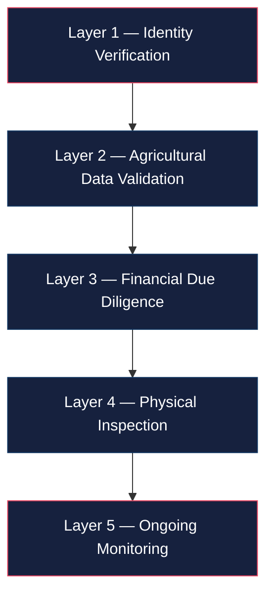

# Verification

> **Aurora Protocol employs a 5-layer verification architecture to ensure that every financed agricultural batch is backed by real, validated assets and credible originators.**

---

## Overview

Trust in real-world asset (RWA) protocols depends on the quality and reliability of off-chain verification. Aurora Protocol addresses this through a layered approach that combines identity checks, agricultural data validation, financial due diligence, on-the-ground inspection, and continuous monitoring.

No single layer operates in isolation — each layer reinforces the others to form a comprehensive trust framework.

---

## 5-Layer Architecture

---

## Layer Details

### Layer 1 — Identity Verification

| Item | Description |
|------|-------------|
| **Purpose** | Confirm the legal identity and legitimacy of the Originator |
| **Checks** | Business registration, director identification, beneficial ownership |
| **Sources** | Government registries, third-party KYB providers |
| **Output** | Verified Originator profile linked to on-chain wallet |

### Layer 2 — Agricultural Data Validation

| Item | Description |
|------|-------------|
| **Purpose** | Validate the agricultural basis of the financing request |
| **Checks** | Crop type, land area, historical yield data, seasonal patterns |
| **Sources** | Agricultural ministry records, satellite imagery, local cooperative data |
| **Output** | Validated crop profile and production forecast |

### Layer 3 — Financial Due Diligence

| Item | Description |
|------|-------------|
| **Purpose** | Assess the financial viability and repayment capacity of the batch |
| **Checks** | Revenue projections, cost structure, debt-to-income ratio, repayment history |
| **Sources** | Financial statements, bank records, prior batch performance |
| **Output** | Financial risk score and recommended batch terms |

### Layer 4 — Physical Inspection

| Item | Description |
|------|-------------|
| **Purpose** | Confirm on-the-ground conditions match submitted data |
| **Checks** | Farm site visit, crop condition, storage facilities, equipment |
| **Sources** | Local inspection partners, photographic evidence, GPS-tagged reports |
| **Output** | Inspection report with approval or rejection recommendation |

### Layer 5 — Ongoing Monitoring

| Item | Description |
|------|-------------|
| **Purpose** | Track batch progress through the milestone lifecycle |
| **Checks** | Planting confirmation, growth progress, harvest verification, delivery confirmation |
| **Sources** | Periodic field reports, satellite monitoring, buyer confirmations |
| **Output** | Milestone verification data fed into `EscrowVault` state transitions |

---

## Verification Summary

| Layer | Focus | Timing | Data Source |
|-------|-------|--------|-------------|
| **L1** — Identity | Who is the Originator? | Pre-onboarding | KYB providers, registries |
| **L2** — Agricultural | What is being financed? | Pre-batch | Agri data, satellite |
| **L3** — Financial | Can they repay? | Pre-batch | Financial records |
| **L4** — Physical | Is it real? | Pre-funding | On-site inspection |
| **L5** — Monitoring | Is it progressing? | Post-funding | Field reports, remote sensing |

---

## Current Status and Roadmap

> **Current state**: Verification processes are executed manually by the Aurora operations team with support from local partners in Southeast Asia.

> **Planned enhancements**:
> - Integration with third-party KYC/KYB providers for automated identity verification
> - Oracle-based data feeds for agricultural and weather data
> - On-chain attestation of verification results for public auditability

---

> **Next**: [Unit Economics →](../Economics/Unit-Economics.md)
